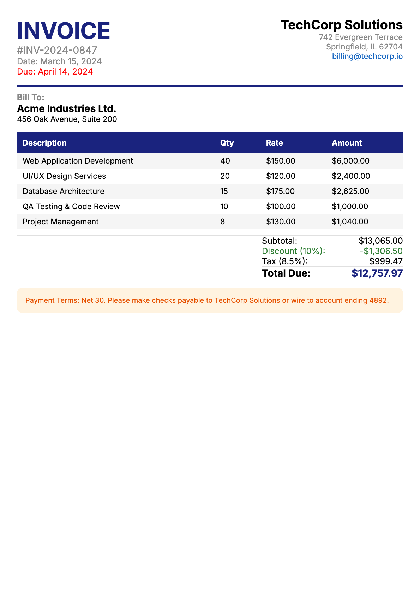
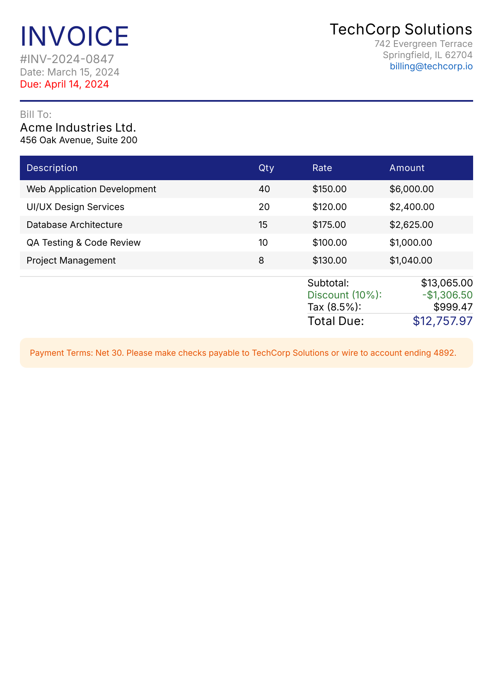

# Compose 2 PDF

[](https://github.com/chrisjenx/compose2pdf/actions/workflows/ci.yml)
[](https://central.sonatype.com/artifact/com.chrisjenx/compose2pdf)
[](https://www.apache.org/licenses/LICENSE-2.0)

A **Kotlin Multiplatform library** for rendering [Compose Multiplatform](https://www.jetbrains.com/compose-multiplatform/) content directly to PDF. Generate production-quality PDF documents on **JVM/Desktop**, **Android**, and **iOS** with vector text, embedded fonts, and auto-pagination.

```kotlin
val pdfBytes = renderToPdf {
    Text("Hello, PDF!")
}
File("hello.pdf").writeBytes(pdfBytes)
```

### Compose in, PDF out

| Compose (reference render) | PDF (vector output) |
|:---:|:---:|
|  |  |

*The PDF output is virtually identical to the Compose reference — text is selectable, fonts are embedded, and the file is only 17 KB.*

## Features

- **Vector PDF output** — text is selectable, scales to any zoom level
- **Raster fallback** — pixel-perfect rendering as an embedded image (JVM)
- **Font embedding** — bundled Inter fonts (JVM) or system font resolution with automatic subsetting
- **Link annotations** — clickable URLs in the PDF via `PdfLink` (JVM)
- **Auto-pagination** — content automatically flows across pages; elements are kept together at page boundaries
- **Multi-page** — render multiple pages in a single PDF (manual or automatic)
- **Page presets** — A4, Letter, A3 with configurable margins and landscape support
- **Streaming output** — write PDFs directly to an `OutputStream` for Ktor, servlets, or any JVM server

## Installation

```kotlin
// build.gradle.kts (Kotlin Multiplatform)
kotlin {
    sourceSets {
        commonMain.dependencies {
            implementation("com.chrisjenx:compose2pdf:1.0.0")
        }
    }
}

// Or for JVM/Android-only projects:
dependencies {
    implementation("com.chrisjenx:compose2pdf:1.0.0")
}
```

## Platform support

| Platform | Requirements | Status |
|:---------|:-------------|:-------|
| **JVM/Desktop** (macOS, Linux, Windows) | JDK 17+, Compose Multiplatform 1.9+ | Full support |
| **Android** | minSdk 24, Compose Multiplatform 1.9+ | Full support |
| **iOS** (arm64, x64, simulatorArm64) | Compose Multiplatform 1.9+ | Full support |

### Platform feature matrix

| Feature | JVM | Android | iOS |
|:--------|:---:|:-------:|:---:|
| Vector output | VECTOR / RASTER modes | Always vector | Always vector |
| Auto-pagination | Yes | Yes | Yes |
| Multi-page (manual) | Yes | -- | -- |
| OutputStream streaming | Yes | Yes | -- |
| `PdfLink` annotations | Yes | -- | -- |
| Bundled Inter font | Yes | -- (system fonts) | -- (system fonts) |
| `suspend` API | No | Yes (required) | No |

## Compatibility

[](https://github.com/chrisjenx/compose2pdf/actions/workflows/compatibility.yml)

Tested weekly against the 3 most recent Compose Multiplatform releases:

| Compose Multiplatform | Kotlin | Status |
|:----------------------|:-------|:-------|
| 1.11.0-alpha04 | 2.3.20 | CI tested |
| **1.10.3** | 2.3.20 | CI tested (current) |
| 1.9.3 | 2.3.20 | CI tested |

## Quick start

### JVM

```kotlin
val pdf = renderToPdf(
    config = PdfPageConfig.LetterWithMargins,
    mode = RenderMode.VECTOR,
) {
    Column(Modifier.fillMaxSize().padding(24.dp)) {
        Text("Invoice #1234", fontSize = 24.sp, fontWeight = FontWeight.Bold)
        Text("Amount: $1,250.00")
    }
}
```

### Android

```kotlin
val pdfBytes = renderToPdf(
    context = applicationContext,
    config = PdfPageConfig.A4WithMargins,
) {
    Column(Modifier.fillMaxSize().padding(24.dp)) {
        Text("Hello from Android!")
    }
}
```

### iOS

```kotlin
val pdfBytes = renderToPdf(
    config = PdfPageConfig.A4WithMargins,
) {
    Column(Modifier.fillMaxSize().padding(24.dp)) {
        Text("Hello from iOS!")
    }
}
```

### Auto-pagination (default)

Content automatically flows across pages. Direct children are kept together — if a child would straddle a page boundary, it's pushed to the next page.

```kotlin
val pdf = renderToPdf(config = PdfPageConfig.A4WithMargins) {
    ReportHeader()
    DataTable(items)       // kept together on one page
    SummarySection()       // pushed to next page if needed
}
```

### Manual multi-page (JVM)

For full control over what goes on each page:

```kotlin
val pdf = renderToPdf(pages = 3) { pageIndex ->
    Column(Modifier.fillMaxSize()) {
        Text("Page ${pageIndex + 1}")
    }
}
```

### Links (JVM)

```kotlin
PdfLink(href = "https://example.com") {
    Text("Click me", color = Color.Blue, textDecoration = TextDecoration.Underline)
}
```

## How it works

Each platform uses a native PDF pipeline:

- **JVM**: Compose → Skia SVGCanvas → SVG → Apache PDFBox → vector PDF with embedded fonts
- **Android**: Compose → off-screen virtual display → `android.graphics.pdf.PdfDocument` Canvas → vector PDF
- **iOS**: Compose → Skia SVGCanvas → SVG → Core Graphics (`CGPDFContext`) → vector PDF

> **Want native PDF output from Skia?** The [Skiko PR #775](https://github.com/JetBrains/skiko/pull/775) proposes adding a direct PDF backend to Skia/Skiko, which would eliminate the SVG intermediary entirely — producing smaller files, faster rendering, and full gradient/effect support in vector mode. If this matters to you, upvote the PR!

## Documentation

**[Full documentation](https://chrisjenx.github.io/compose2pdf/)** — getting started, usage guides, API reference, examples, and more.

- [Getting Started](https://chrisjenx.github.io/compose2pdf/getting-started.html)
- [Usage Guide](https://chrisjenx.github.io/compose2pdf/usage/)
- [API Reference](https://chrisjenx.github.io/compose2pdf/api/)
- [Examples](https://chrisjenx.github.io/compose2pdf/examples/)
- [Compatibility](https://chrisjenx.github.io/compose2pdf/compatibility.html)
- [Troubleshooting](https://chrisjenx.github.io/compose2pdf/guides/troubleshooting.html)

## License

Apache-2.0
